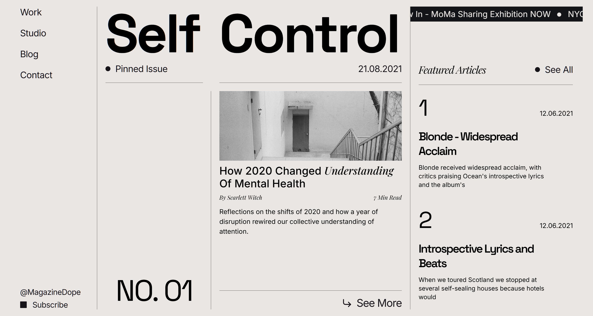

# Style Guide



Source of truth: [src/styles/global.scss](src/styles/global.scss).

## Colors

| Token             | Hex       | Use                                             |
| ----------------- | --------- | ----------------------------------------------- |
| `$blog-bg`        | `#e9e6e4` | Page background                                 |
| `$body-bg`        | `#121418` | Dark surfaces (marquee, Circle, footer, button) |
| `$title-color`    | `#121418` | Headings                                        |
| `$subtitle-color` | `#161419` | Body, menu                                      |
| `$border-color`   | `#94918f` | All 1px dividers                                |

No gradients, shadows, or accent colors.

## Typography

| Family                  | Role                          | Weights    |
| ----------------------- | ----------------------------- | ---------- |
| Space Grotesk           | Display, titles, page numbers | 400 to 700 |
| Inter                   | Body, UI                      | 300 to 600 |
| Playfair Display Italic | Emphasis, pull-quotes         | 400 to 500 |

**Scale:** hero `132px` then `9vw` then `18vw`; page-title `clamp(40px, 7vw, 88px)`; article H2 `32px`; menu `22px` then `1.6vw`; body `18px`; meta `13` to `14px`. Letter-spacing tightens with size (`-0.5px` to `-5px`).

## Layout

Two modes:

1. **Magazine cover** (`/`): bespoke 4-col grid (`15% 20% 35% 30%`), `100dvh`, no `PageLayout`.
2. **Subpage**: `PageLayout` with top nav, optional hero, `.page-main` (max 920px), footer.

**Breakpoints:** 1400, 1260, 1030, 768, 560.
Hamburger appears at ≤1030, single column at ≤768.

**Dividers:** `1px solid $border-color`. Never thicker.

## Components

| File                                                      | Purpose                                |
| --------------------------------------------------------- | -------------------------------------- |
| [`Menu`](src/components/Menu.astro)                       | Primary nav (left rail, mobile drawer) |
| [`Footer`](src/components/Footer.astro)                   | Subpage footer                         |
| [`StickyHeader`](src/components/StickyHeader.astro)       | "Self / Pinned Issue / NO. xx"         |
| [`FeaturedArticle`](src/components/FeaturedArticle.astro) | Magazine hero card (scroll-snaps)      |
| [`Sidebar`](src/components/Sidebar.astro)                 | Marquee + featured list + Circle       |
| [`Circle`](src/components/Circle.astro)                   | Dark circular CTA                      |
| [`Marquee`](src/components/Marquee.astro)                 | Dark scrolling ticker                  |

## Layouts

- [`BaseLayout`](src/layouts/BaseLayout.astro): `<html>` shell, head meta (canonical, OG, RSS alternate), global SCSS.
- [`PageLayout`](src/layouts/PageLayout.astro): subpage frame. Copy for any new page.

## Prose

Long-form copy opts in to `.prose`:

```astro
<PageLayout title="…">
  <div class="prose">
    <p>…</p>
  </div>
</PageLayout>
```

Gives you 18px / 1.65, max 65ch, Space Grotesk H2/H3, Playfair blockquote, grayscale ``. Do not wrap card grids, forms, or work/tag lists; `.prose a` underlines everything inside.

## Imagery

Grayscale (`filter: grayscale(1)`). Editorial / portrait stock.

## Do / Don't

**Do:** reuse `$border-color`; italicise one word per headline via `<span>`; use `clamp()` and `vw` for fluid type.

**Don't:** add a fourth font; introduce color, gradients, or shadows; wrap structured layouts in `.prose`; nest `<a>` inside `<a>`.

## Adding a subpage

1. Copy [`src/pages/_template.astro.example`](src/pages/_template.astro.example) to `src/pages/<name>.astro`.
2. Set `title`, `description`, `eyebrow` (and `heroImage` if you want one).
3. Add to `items[]` in [`Menu`](src/components/Menu.astro) if it should appear in nav.
